<p align="center">
  
</p>

<p align="center">
  <a href="https://github.com/DenverCoder1/readme-typing-svg">
    <picture>
      <source media="(prefers-color-scheme: dark)" srcset="https://readme-typing-svg.demolab.com?font=Fira+Code&weight=500&size=18&duration=4000&pause=1200&color=FFD76A&center=true&vCenter=true&width=900&lines=When+you+want+something%2C+all+the+universe+conspires+in+helping+you+to+achieve+it.;It%27s+the+possibility+of+having+a+dream+come+true+that+makes+life+interesting.;The+secret+of+life+is+to+fall+seven+times+and+to+get+up+eight+times.;The+fear+of+suffering+is+worse+than+the+suffering+itself.;%E2%80%94+Paulo+Coelho%2C+The+Alchemist" />
      
    </picture>
  </a>
</p>

<p align="center">
  
  <a href="https://github.com/7csc?tab=followers"></a>
  <a href="https://github.com/7csc?tab=repositories"></a>
</p>

<h2 align="center"> About Me</h2>

```go
package main

type Engineer struct {
	Name     string
	Work     []string
	Hobby    []string
	Learning []string
	Cloud    []string
	Certs    []string
	AtCoder  string
}

var me = Engineer{
	Name:     "7csc",
	Work:     []string{"Python", "TypeScript"},
	Hobby:    []string{"Go"},
	Learning: []string{"Rust", "BigQuery", "Data Engineering"},
	Cloud:    []string{"AWS", "Azure", "GCP", "Kubernetes"},
	Certs:    []string{"AWS", "Azure", "CKA", "CKAD", "CCNA", "Datadog"},
	AtCoder:  "Python",
}
```

<h2 align="center"> Tech Stack</h2>

<table align="center">
  <tr>
    <td align="center"><br><b>Languages</b></td>
    <td></td>
  </tr>
  <tr>
    <td align="center"><br><b>Frontend</b></td>
    <td></td>
  </tr>
  <tr>
    <td align="center"><br><b>Backend</b></td>
    <td>
      <br>
      
      
    </td>
  </tr>
  <tr>
    <td align="center"><br><b>Cloud / Infra</b></td>
    <td>
      <br>
      
    </td>
  </tr>
  <tr>
    <td align="center"><br><b>Tools</b></td>
    <td></td>
  </tr>
  <tr>
    <td align="center"><br><b>Learning</b></td>
    <td>
      <br>
      
      
    </td>
  </tr>
</table>

<h2 align="center"> Stats</h2>

<p align="center">
  <a href="https://github.com/stats-organization/github-stats-extended">
    <picture>
      <source media="(prefers-color-scheme: dark)" srcset="https://github-stats-extended.vercel.app/api?username=7csc&count_private=true&include_all_commits=true&show_icons=true&rank_icon=github&bg_color=0d1117&title_color=ff5fa2&icon_color=ffd76a&text_color=c9d1d9&ring_color=ff5fa2&hide_border=true" />
      
    </picture>
  </a>
  <a href="https://github.com/stats-organization/github-stats-extended">
    <picture>
      <source media="(prefers-color-scheme: dark)" srcset="https://github-stats-extended.vercel.app/api/top-langs/?username=7csc&count_private=true&layout=compact&bg_color=0d1117&title_color=ff5fa2&text_color=c9d1d9&hide_border=true" />
      
    </picture>
  </a>
</p>

<p align="center">
  <a href="https://github.com/DenverCoder1/github-readme-streak-stats">
    <picture>
      <source media="(prefers-color-scheme: dark)" srcset="https://streak-stats.demolab.com?user=7csc&background=0d1117&ring=ff5fa2&fire=ffd76a&currStreakNum=ffffff&currStreakLabel=ff5fa2&sideNums=ffffff&sideLabels=a39be0&dates=8b949e&stroke=30363d&hide_border=true" />
      
    </picture>
  </a>
</p>

<p align="center">
  <a href="https://github.com/7csc/github-profile-trophy">
    
  </a>
</p>

<p align="center">
  <picture>
    <source media="(prefers-color-scheme: dark)" srcset="https://raw.githubusercontent.com/7csc/7csc/output/github-snake-dark.svg" />
    
  </picture>
</p>

<h2 align="center"> Certificates</h2>

<div align="center">

<!--START_SECTION:badges-->
[](http://www.credly.com/badges/131bbad9-1e1d-4224-aee3-570e033ecebb "Microsoft Certified: Azure Fundamentals")
[](http://www.credly.com/badges/9f087053-953c-4200-b99a-87bd89f5f9b9 "AWS Certified Solutions Architect – Associate")
[](http://www.credly.com/badges/6ca8d207-4e20-49d1-b40f-45021dfecc7c "CCNA")
[](http://www.credly.com/badges/4b2f4207-dc89-4c3c-8391-0e871b556254 "Microsoft Certified: Azure Administrator Associate")
[](http://www.credly.com/badges/fa7f5b02-f3a2-4691-8de3-b9a831c54fdc "AWS Certified Developer – Associate")
[](http://www.credly.com/badges/85a82ae2-d255-479f-ad0e-be33bf29cb76 "CKA: Certified Kubernetes Administrator")
[](http://www.credly.com/badges/fc00913b-1a9c-43f9-85d8-4c7148bbae83 "AWS Certified Solutions Architect – Professional")
[](http://www.credly.com/badges/9dcf9c75-b9c3-43cf-86e7-6d805a90f061 "AWS Certified SysOps Administrator – Associate")
[](http://www.credly.com/badges/1fa3ac2b-3fd4-42cc-accf-5caf4219cf4b "CKAD: Certified Kubernetes Application Developer")
[](http://www.credly.com/badges/8dfcf90c-1e32-4933-b98f-32877404a845 "AZ-400: Designing and Implementing Microsoft DevOps Solutions")
[](http://www.credly.com/badges/acb08828-41d9-4e25-976e-4379e4f02d06 "AWS Certified DevOps Engineer – Professional")
[](http://www.credly.com/badges/247b5eeb-7c83-4199-98d5-85d14beb2828 "Microsoft Certified: DevOps Engineer Expert")
[](http://www.credly.com/badges/a35238e2-51d3-481d-9926-1f1c7f2c024c "Datadog Certified: Datadog Fundamentals")
<!--END_SECTION:badges-->

</div>


